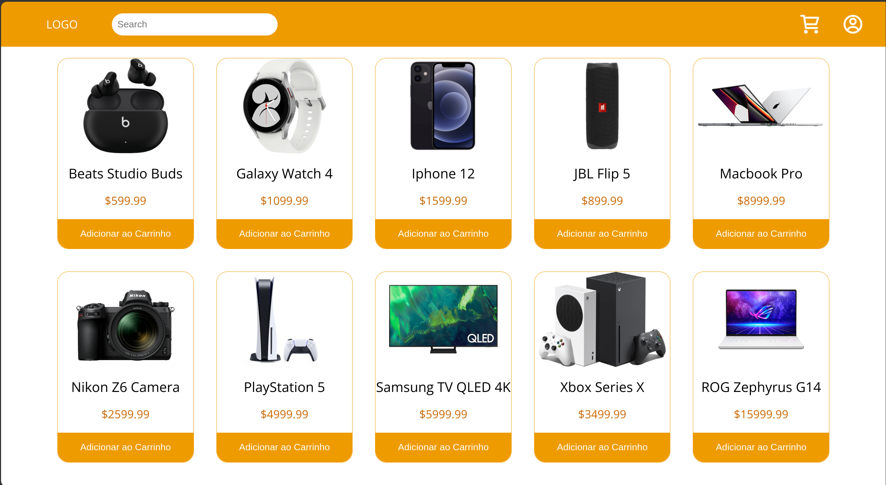
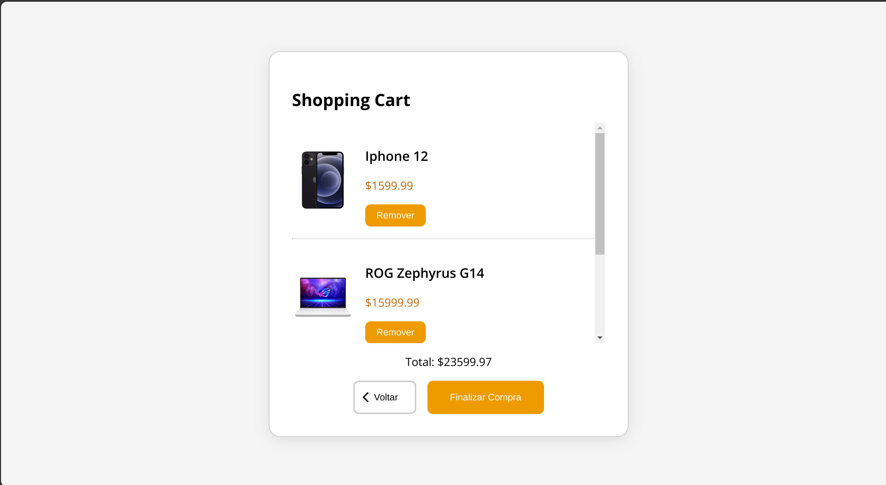

<h1 align="center">Ecommerce Project</h1>

This is a web project made with HTML, CSS, JavaScript, PHP and MySQL for studying purposes

This app is on V0.8

</img>
</img>
</img>

### Tools

The following tools have been used in the project:

- [HTML](https://html.com/)
- [CSS](https://developer.mozilla.org/pt-BR/docs/Web/CSS)
- [JavaScript](https://www.javascript.com/)
- [PHP](https://www.php.net/)
- [VS Code](https://code.visualstudio.com)
---

### Author
Made by Johan Stromberg :fire:

